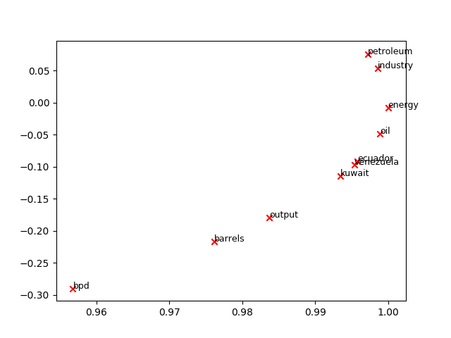

## Introduction

- `count_based_word_vec.py`: stanford CS224's assignment 1
- `sample_word2vec.py`: sample code for playing with gensim's word2vec

## Some results

- If you run `count_based_word_vec.py`, you'd the following results.

