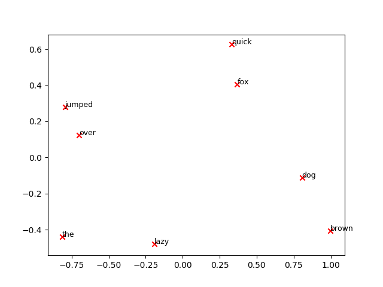
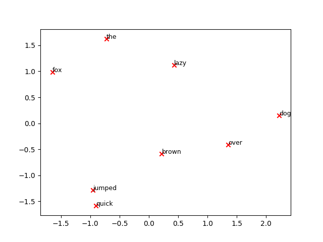

## Introduction
To implement `word2vec` from scratch myself, firstly, I've decided to do some research to find a correct implementation from scratch by someone since tackling to the bare code of `gensim` seemed a bit difficult.

So I have compared the implementation of [Nathan Rooy](https://github.com/nathanrooy/word2vec-from-scratch-with-python) to the `gensim` one using a really simple one sentence. `['the', 'quick', 'brown', 'fox', 'jumped', 'over', 'the', 'lazy', 'dog']`. I know the hyper-params always matter tho, at least the following images are the results of runs.

## Results

- Result: `gensim_word2vec.py`

  

- Result: `sample1.py`

  
